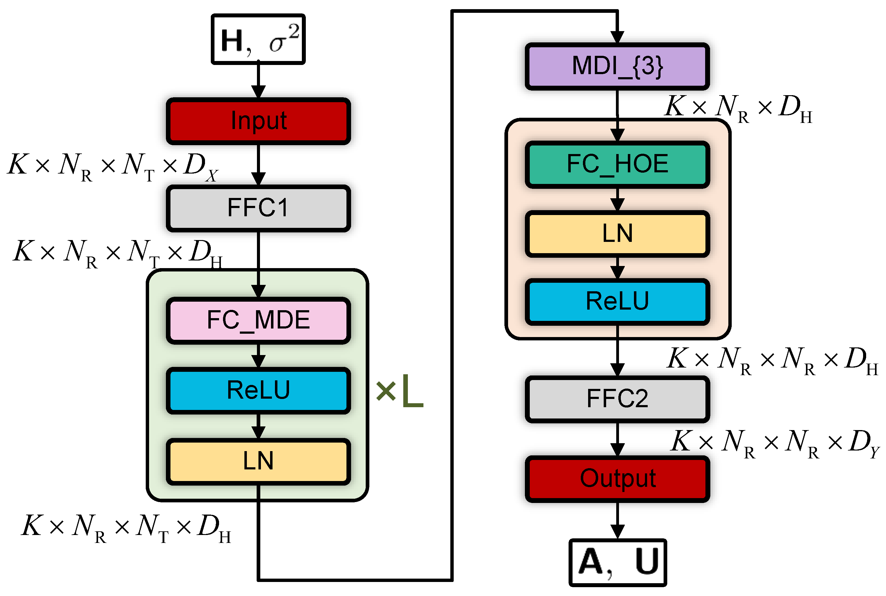
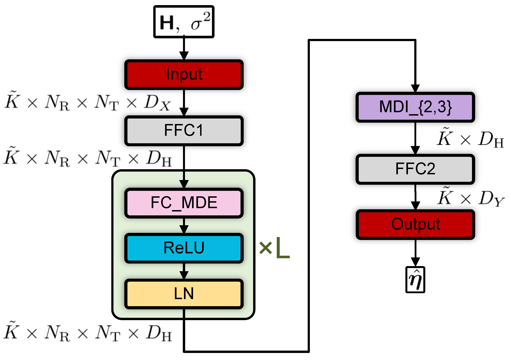

# 🧊 TENN Toolbox

[](https://github.com/zhangjinshuowww/TENN)
[](https://arxiv.org/abs/2406.09022)
[](https://ieeexplore.ieee.org/document/11049893)
[](https://github.com/zhangjinshuowww/TENN/blob/main/LICENSE)

A unified, plug-and-play toolbox for building tensor equivariant neural networks (TENN), designed to support communication system applications such as multi-user multiple-input multiple-output (MU-MIMO) precoding, user scheduling, channel estimation, detection, demodulation, and so on. More information can be found in paper "[Towards Unified AI Models for MU-MIMO Communications: A Tensor Equivariance Framework](https://arxiv.org/abs/2406.09022)", which has been accepted for publication on top journal ***IEEE Transactions on Wireless Communications***. 

## 🧠 Core Concepts

This toolbox implements a unified framework for leveraging **Tensor Equivariance (TE)** into neural network design. ***By exploiting the inherent TE of the target mapping, it facilitates scalable and efficient learning in AI-assisted wireless communication systems***.
TE extends the concept of permutation equivariance to high-dimensional tensors and includes:

- **Multidimensional Equivariance (MDE)**: Permuting each tensor dimension independently results in the same permutation at the output.
- **High-Order Equivariance (HOE)**: The same permutation is applied across multiple dimensions simultaneously.
- **Multidimensional Invariance (MDI)**: Output remains unchanged under permutations along specified dimensions.

Some examples of TE:


## ✨ Key Features

- 🌱 **Scalable**: Generalizes to varying input sizes without retraining.
- ⚡ **Efficient**: Requires fewer parameters, lower computational complexity, and smaller training sets.
- 🌐 **Unified**: Compatible with data/model-driven approaches, as well as various learning paradigms.
- 📦 **Modular**: Drop-in layers for various types of equivariance.
- 📡 **Application-ready**: Comes with precoding and scheduling examples for MU-MIMO communications.


## 🔧 Module Introduction

This toolbox includes several pluggable neural modules, each aligned with a theoretical symmetry property:

| Module 🧩 (abbr.)                           | Function ⚙️                                               | Dimensions ♾️                                                                                   |
|:-------------------------------------------|:----------------------------------------------------------|:-----------------------------------------------------------------------------------------------|
| **MDE**<br>    | The equivalent linear module when any fully connected layer satisfies permutation equivariance across an arbitrary number of dimensions.  | **In**: <br> $\mathrm{bs}\times M_1\times \dots \times M_N\times D_I$  <br> **Out**: <br> $\mathrm{bs}\times M_1\times \dots \times M_N\times D_O$ |
| **HOE**<br>        | The equivalent linear module when an arbitrary fully connected layer exhibits equivariance to identical permutations across multiple input and output dimensions. (taking 1-2-order equivariance as an example).           | **In**: <br> $\mathrm{bs}\times M\times D_I$  <br> **Out**: <br> $\mathrm{bs}\times M\times M\times D_I$   |
| **MDI**<br>     | A nonlinear module based on the attention mechanism that satisfies permutation invariance across an arbitrary number of dimensions.     | **In**: <br> $\mathrm{bs}\times M_1\times \dots \times M_N\times D_I$  <br> **Out**: <br> $\mathrm{bs}\times D_O$                |




### 📌 Example 1: Precoding
The `PrecodingTECFP` network includes:
- A multidimensional equivariant network
- A multidimensional invariant module
- A high-order equivariant module

Under the model-driven approach, the network maps the CSI to the optimal auxiliary variables in the closed-form precoding expression, solving the WMMSE precoding problem for MU-MIMO systems.

<br>
<br>



### 📌 Example 2: Scheduling
The `SchedulingTEUSN` network, trained with both WMMSE and MMSE encoding methods, includes:
- A multidimensional equivariant network
- A multidimensional invariant module

Under the data-driven approach, the network maps the CSI to the optimal user scheduling indicator, solving the user scheduling optimization problem in MU-MIMO systems.

<br>
<br>

## 🏗️ Project Structure

### `TE_models/`
Contains core model definitions:
- `init_func.py`: Initialization functions, common utilities, and parameter management classes
- `TE_models.py`: Multidimensional equivariant network and pattern-generation functions
- `TE_module.py`: Multidimensional equivariant and invariant modules, and high-order equivariant module

### `examples/data/`
Folder for storing training and testing data.

**For Example 1 (Precoding):**
- Channel data files named `"data_name.mat"` with dimensions `[sample_num, ue_num, rx_ant_num, tx_ant_num]`

**For Example 2 (Scheduling):**
- Channel data files named `"data_name.mat"` with dimensions `[sample_num, ue_num, rx_ant_num, tx_ant_num]`
- Eta label files named `"data_name_etaMMSE"` or `"data_name_etaWMMSE"` with dimensions `[sample_num, snr_num, ue_num]`

### `examples/precoding/`
Contains precoding-related models and training code (Example 1):
- `precoding_func.py`: Training and testing functions
- `precoding_models.py`: Network model definitions and related functions
- `precoding_test.py`: Main testing program
- `precoding_train.py`: Main training program

### `examples/scheduling/`
Contains scheduling-related models and training code (Example 2):
- `scheduling_func.py`: Training and testing functions
- `scheduling_MMSE_test.py`: Testing program for MMSE-trained network
- `scheduling_WMMSE_test.py`: Testing program for WMMSE-trained network
- `scheduling_MMSE_train.py`: Training program for MMSE labels
- `scheduling_WMMSE_train.py`: Training program for WMMSE labels
- `scheduling_models.py`: Network model definitions and related functions

### `examples/save_models/`
Stores network training results.

## 🚀 Usage

### Multidimensional Equivariant Network (MDE_Network)

The `MDE_Network` class implements a multidimensional equivariant neural network architecture.  It is constructed by stacking MDE modules and allows for significant reduction in parameter count and computational complexity by selecting different patterns, while preserving performance as much as possible (see Section III-A of the paper for the design and selection of patterns).
#### Basic Usage

```python
from TE_models import MDE_Network
from TE_models import generate_patterns

# Define the pattern of the network
MDE_dim_list = generate_patterns(n_layer=3, n_dim=3, pattern='original')

# Initialize the network
network = MDE_Network(
    d_input=4,      # Input dimension
    d_output=8,     # Output dimension
    n_layer=3,       # Number of equivariant layers
    d_hidden=32,    # Hidden layer dimension
    dim_list=MDE_dim_list # List of dimensions for equivariance
)

# Input tensor shape: [batch_size, dim_1, ..., dim_n, d_input]
# Output tensor shape: [batch_size, dim_1, ..., dim_n, d_output]
output = network(input_tensor)
```

### Multidimensional Invariant Module (MDI_Module)

The `MDI_Module` class implements a multidimensional invariant neural network module.
#### Basic Usage

```python
from TE_module import MDI_Module

# Initialize the module
mdi_module = MDI_Module(
    d_feature=64,    # Feature dimension
    num_heads=8,     # Number of attention heads
    dim=[1, 2]       #  Invariant Dimensions
)

# Input tensor shape: [batch_size, M1, M2, ..., MN, d_feature]
# Output tensor shape: [batch_size, M1, M2, ..., MK, d_feature], where dimensions in 'dim' are removed
output = mdi_module(input_tensor)
```

## 📚 Citation

If you use this toolbox in your research, please cite our [paper](https://ieeexplore.ieee.org/document/11049893):

> Y. Wang, H. Hou, X. Yi, W. Wang, S. Jin, “Towards Unified AI Models for MU-MIMO Communications: A Tensor Equivariance Framework,” _arXiv:2406.09022_, 2024.

```bibtex
@ARTICLE{11049893,
  author={Wang, Yafei and Hou, Hongwei and Yi, Xinping and Wang, Wenjin and Jin, Shi},
  journal={IEEE Transactions on Wireless Communications}, 
  title={Towards Unified AI Models for MU-MIMO Communications: A Tensor Equivariance Framework}, 
  year={2025},
  volume={},
  number={},
  pages={1-1},
  keywords={Artificial intelligence;tensor equivariance;unified framework;MU-MIMO transmission},
  doi={10.1109/TWC.2025.3580321}}
```


## 🤝 Acknowledgments
We are grateful to Jinshuo Zhang (Southeast University) for his dedicated efforts in preparing and refining the code for open-source release. We also sincerely thank all the reviewers and editors of this paper for their insightful comments and valuable suggestions.
